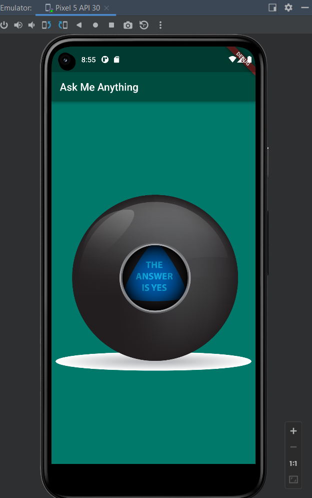

# Magic 8 Ball Flutter
It is my 4th flutter app while learning the flutter. It was a
Challenge given by the Mentor.

## Functionality:

It has functionality of magic ball when clicked it will answer/ suggest
you out of Eight

## Learning 

I have learned and Used in this Project

1.  Statefull Widget

2.  Variable

3.  Dart:math

4.  Random

5.  Functions

6.  Text Button

7.  Expanded

## Final Screenshot

